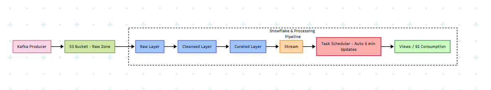
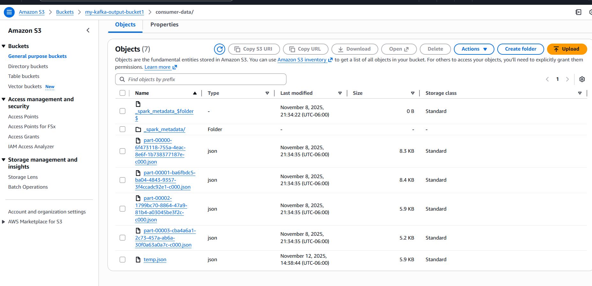
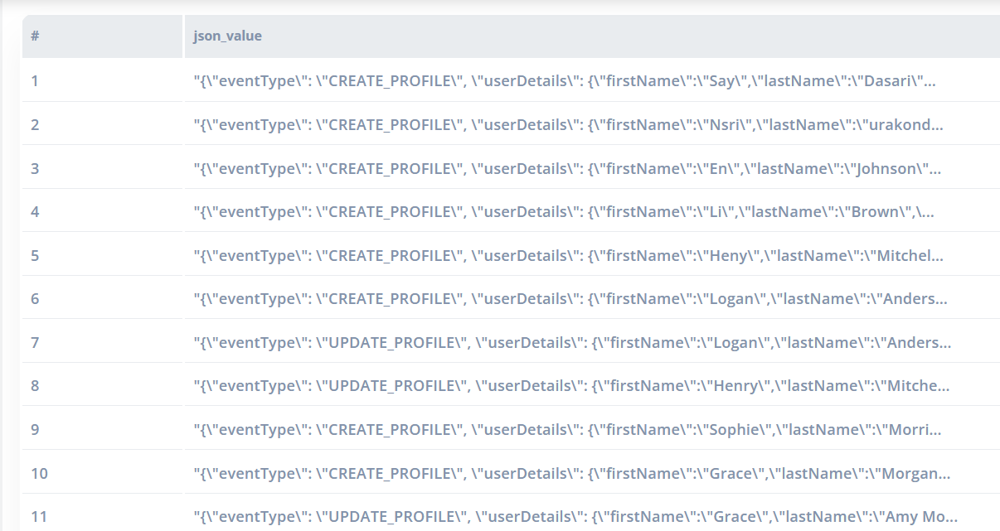
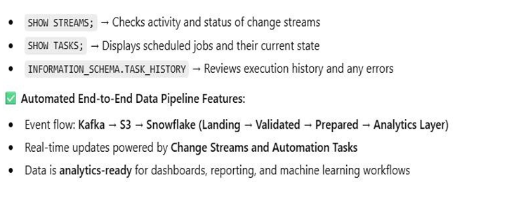
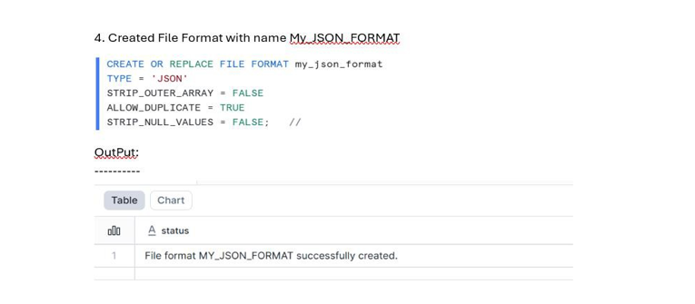
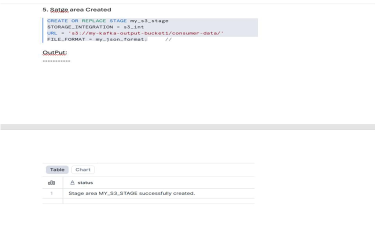
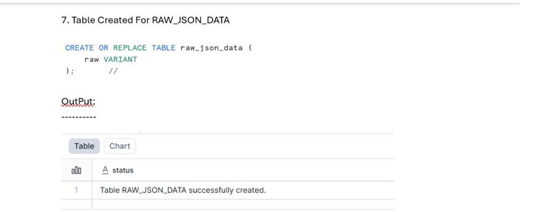
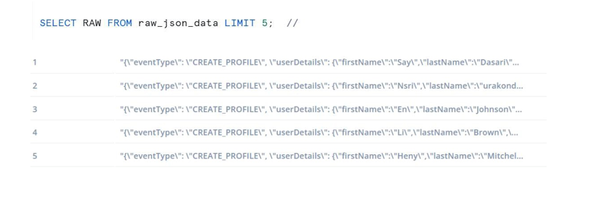
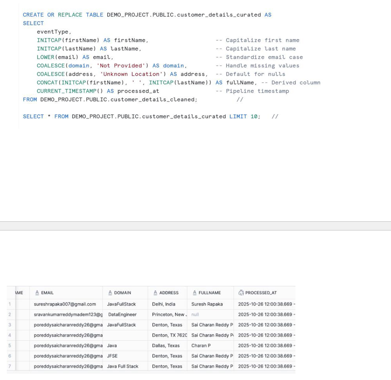
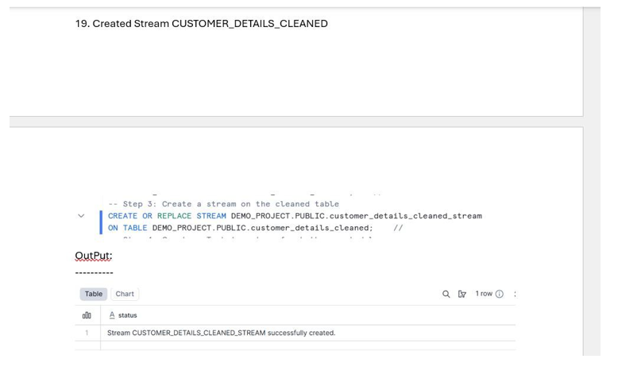

**Event-Driven Customer Data Flow — Kafka → S3 → Snowflake**

**Overview**\
This project showcases a complete event-driven data pipeline designed to capture, process, and organize customer activity data in near real time. It leverages Kafka for data ingestion, Amazon S3 for scalable storage, and Snowflake for analytics and transformation, creating an automated and robust architecture that supports business intelligence and data science initiatives.

**Architecture :**

**Components:**

|**Component**|**Description**|
| :- | :- |
|**Kafka Producer** |Simulates or produces customer activity events, such as new account creation or profile updates.|
|**Amazon S3 (Raw Zone)** |Serves as the initial storage location for raw, unprocessed data in formats like JSON or CSV coming from Kafka.|
|**Snowflake Stage**|Links the S3 bucket to Snowflake, enabling data ingestion.|
|**Snowpipe**|Automatically loads incoming raw data from S3 into Snowflake tables without manual intervention.|
|**Snowflake Layers (Raw → Cleansed → Curated)**|Sequential transformation layers that clean, standardize, and prepare data for analysis.|
|**Streams** |Monitor and capture real-time changes in the data for incremental processing.|
|**Tasks** |Automate periodic updates and merges to maintain curated tables, typically every 5 minutes.|
|**Analytics / Reporting Layer** |Provides ready-to-use datasets for business intelligence, dashboards, and reporting purposes.|

**End-to-End Pipeline Walkthrough\
Step 1 — Generating Events and Storing in S3**\
Customer activity events are generated using a Kafka producer script (producer.py).\
Each event carries information such as event type, customer name, email, domain, and address.\
These events are grouped and saved into an Amazon S3 bucket (s3://customer-activity-raw-zone).\
This S3 bucket serves as the raw storage layer, which will later be ingested into Snowflake.\
Flow: Kafka producer → S3 upload of raw event files

**TempFile:\
--------------**

**Snowflake Layer Overview**

**Pipeline Monitoring & Verification**

**Create Storage Integration:**

This allows Snowflake to read from your S3 bucket securely.

**Retrieve Snowflake Integration ARN Details:**

this screenshot shows your Snowflake integration is fully created and Snowflake generated everything correctly.\
\
Trust Policy:\
\---------------

Define a JSON File Format in Snowflake:

CREATE OR REPLACE FILE FORMAT My\_JSON\_FORMAT TYPE = 'JSON' STRIP\_OUTER\_ARRAY = FALSE;

External Stage Setup

Snowflake shortcut to your S3 folder (customer-data/) using secure integration. Reads data in **JSON** format for easy ingestion.

**Create a Table for Raw JSON Data:**

This table stores the raw JSON data in Snowflake. The VARIANT column type allows you to keep nested or semi-structured fields exactly as they appear in your JSON files, without needing to flatten them immediately.

**Ingesting Raw Data Using Snowpipe\
Automating Raw Data Loading with Snowpipe**\
This **pipe** automatically ingests new JSON files from the S3 stage (@my\_s3\_stage) as soon as they appear.\
The AUTO\_INGEST = TRUE option ensures **real-time loading** without manual intervention.\
Files matching the pattern .\*[.]json$ are copied into the **raw\_json\_data** table using the specified JSON file format (my\_json\_format).\
This populates the **Raw layer** in Snowflake for further transformations.

**Verify the Data :**

After the Snowpipe starts ingesting data, this query **checks the first few rows** in the raw\_json\_data table. It lets you quickly confirm that the **raw JSON data** from S3 has been successfully loaded into Snowflake.

**Building the Cleansed Layer**

Data from the **raw layer** is transformed to ensure proper structure and improve data quality.\
Functions like COALESCE and INITCAP can be applied to **handle nulls and standardize values**.\
The resulting **cleansed table** contains a structured and validated version of the raw JSON data, ready for further processing.

The WITH cleaned AS ... step removes unwanted quotes from the JSON strings.\
PARSE\_JSON converts the cleaned string into JSON objects.\
Specific fields like eventType, firstName, lastName, email, domain, and address are **extracted and cast to string**.\
The result is a **structured, cleansed dataset** ready for the next layer in your pipeline.

**Setting Up Streams for Change Tracking**

- A **stream** is defined on the cleansed table to track **new or updated records**.
- Streams function as **change-data-capture (CDC)** in Snowflake, allowing incremental data processing.

**Automating Updates with Tasks**

- A **Task** runs every 5 minutes to merge stream changes into the curated table.
- This ensures the curated dataset stays in sync automatically.

**Creating Analytical Views**

- Create summarized views for quick BI insights.

[def]: Aspose.Words.bd2d01ed-6400-4569-89e0-4174764895d0.001.png
